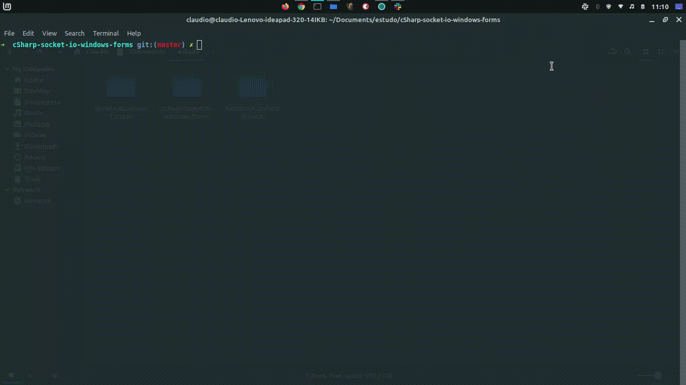

<h4 align="center"> 
  
</h4>

<br>

<h3 align="center">
  📄 Padrões de commit 
</h3>

<p align="center">
  O <strong>commit</strong> do cógido é uma coisa <strong>muito importante</strong> para nós desenvolvedores, por isso é sempre bom adotarmos <strong>padrões para nossos commits</strong>. Abaixo, iremos apresentar um padrão de commit com título, corpo e emoji.
</p>

## 🎨 Styleguide

- Utilize modo imperativo: "Adiciona feature";
- Primeira linha deve ter no máximo 72 caracteres;
- Considere descrever com detalhes no corpo do commit;
- Considere usar um emoji no início da mensagem de commit;

## 📝 Exemplo
```bash
git commit -m ":memo: Adiciona README
>
> Foi criado o arquivo README.md com as informações mais relevantes do repositório"
``` 

## ✔️ Resultado


## 🔥 Como fazer pelo terminal

```bash
// Adicione
$ git add .

// Faça o commit
$ git commit -m ":memo: Adiciona README
>
> Foi criado o arquivo README.md com as informações mais relevantes do repositório"
// Para realizar a quebra de linha pelo terminal, você terá que abrir aspas " e clicar enter sem fechar as aspas " 
// Após finalizar o título e o corpo do commit, você pode fechar as aspas "

// Por fim, faça o push: 
$ git push origin master
```



## 🚀 Padrões de emojis

|   Commit type              | Emoji                                         |
|:---------------------------|:----------------------------------------------|
| Initial commit             | :tada: `:tada:`                               |
| Version tag                | :bookmark: `:bookmark:`                       |
| New feature                | :sparkles: `:sparkles:`                       |
| Bugfix                     | :bug: `:bug:`                                 |
| Metadata                   | :card_index: `:card_index:`                   |
| Documentation              | :books: `:books:`                             |
| Documenting source code    | :bulb: `:bulb:`                               |
| Performance                | :racehorse: `:racehorse:`                     |
| Cosmetic                   | :lipstick: `:lipstick:`                       |
| Tests                      | :rotating_light: `:rotating_light:`           |
| Adding a test              | :white_check_mark: `:white_check_mark:`       |
| Make a test pass           | :heavy_check_mark: `:heavy_check_mark:`       |
| General update             | :zap: `:zap:`                                 |
| Improve format/structure   | :art: `:art:`                                 |
| Refactor code              | :hammer: `:hammer:`                           |
| Removing code/files        | :fire: `:fire:`                               |
| Continuous Integration     | :green_heart: `:green_heart:`                 |
| Security                   | :lock: `:lock:`                               |
| Upgrading dependencies     | :arrow_up: `:arrow_up:`                       |
| Downgrading dependencies   | :arrow_down: `:arrow_down:`                   |
| Lint                       | :shirt: `:shirt:`                             |
| Translation                | :alien: `:alien:`                             |
| Text                       | :pencil: `:pencil:`                           |
| Critical hotfix            | :ambulance: `:ambulance:`                     |
| Deploying stuff            | :rocket: `:rocket:`                           |
| Fixing on MacOS            | :apple: `:apple:`                             |
| Fixing on Linux            | :penguin: `:penguin:`                         |
| Fixing on Windows          | :checkered_flag: `:checkered_flag:`           |
| Work in progress           | :construction:  `:construction:`              |
| Adding CI build system     | :construction_worker: `:construction_worker:` |
| Analytics or tracking code | :chart_with_upwards_trend: `:chart_with_upwards_trend:` |
| Removing a dependency      | :heavy_minus_sign: `:heavy_minus_sign:`       |
| Adding a dependency        | :heavy_plus_sign: `:heavy_plus_sign:`         |
| Docker                     | :whale: `:whale:`                             |
| Configuration files        | :wrench: `:wrench:`                           |
| Package.json in JS         | :package: `:package:`                         |
| Merging branches           | :twisted_rightwards_arrows: `:twisted_rightwards_arrows:` |
| Bad code / need improv.    | :hankey: `:hankey:`                           |
| Reverting changes          | :rewind: `:rewind:`                           |
| Breaking changes           | :boom: `:boom:`                               |
| Code review changes        | :ok_hand: `:ok_hand:`                         |
| Accessibility              | :wheelchair: `:wheelchair:`                   |
| Move/rename repository     | :truck: `:truck:`                             |
| Other                      | [Be creative](http://www.emoji-cheat-sheet.com/)  |


## 🎓 Autores 

| [<br><sub>Vitor Serrano</sub>](https://github.com/vitorserrano) | [<br><sub>Claudio Silva Junior</sub>](https://github.com/Claudio-code) |
| :---: | :---: |

## ⚡ Agradecimentos

- Este repositório foi inspirado no styleguide para commit feito pela [Cristina Silva](https://github.com/crissilvaeng).
- A tabela de emojis foi feita pelo [François Parmentier](https://github.com/parmentf).